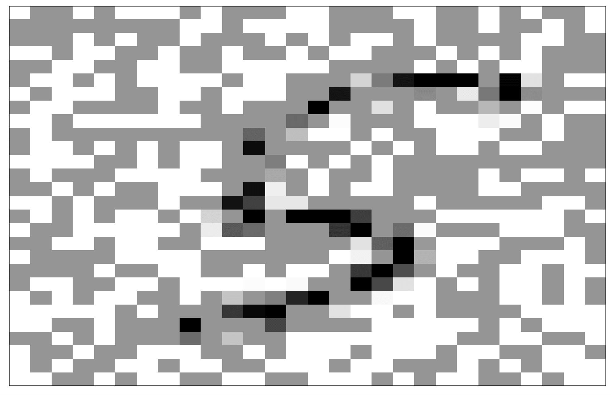
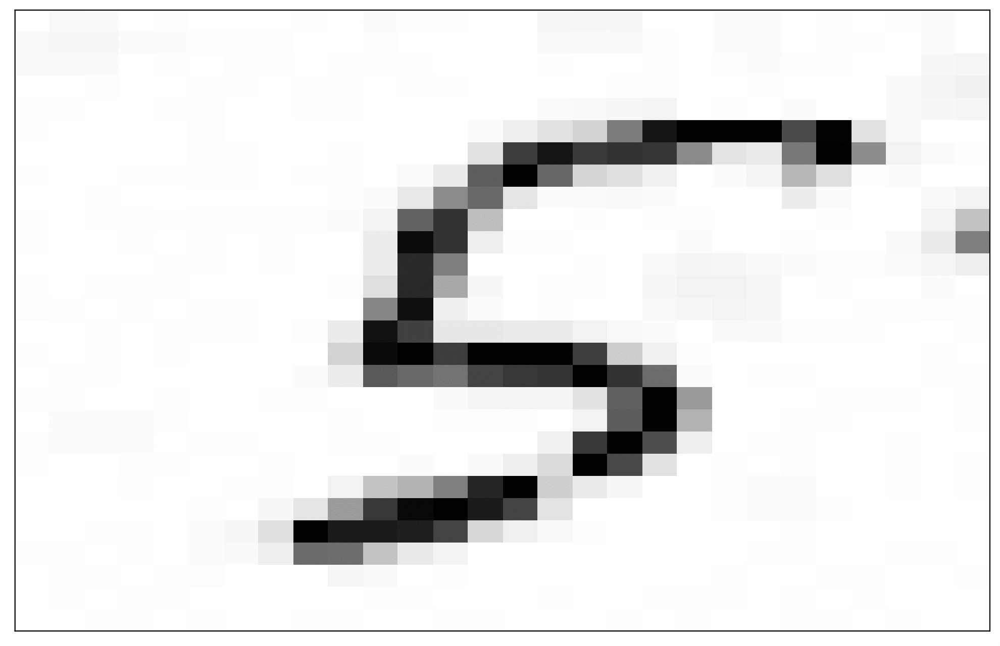

# ORIGINAL INPAINTING CODE BY SERGIO P. PEREZ
* https://github.com/sergiopperez/Image_Inpainting

## IMAGE INPAINTING WITH FLUID DYNAMICS

Image inpainting aims to remove damage from an image. There are various techniques for image inpainting, and here we focus on solving a fluid-type PDE denoted as the Cahn-Hilliard equation.

The three take-home messages from this notebook are that:

1. Image inpainting can be solved with efficient and parallelizable finite-volume schemes
2. The classification accuracy of neural networks is affected by the presence of damage 
3. The application of image inpainting in damaged images improves their classification accuracy

&nbsp;

#### Damaged image:

#### Restored image:

## Notes on damage detection:
1. A dataset was created made of clones of the MNIST dataset with applied horizontal/vertical/square or noise damage, alongside an undamaged clone.
2. A simple CNN network was created utilizing the focal loss function and was trained on the dataset for 5 epochs.
3. The CNN network predicts the damage on a pixel scale.
4. After the prediction mask is created, the otsu filter is used to clean up the prediction map. Then the images and their corresponding masks can be pipelined into the inpainting algorithm.
